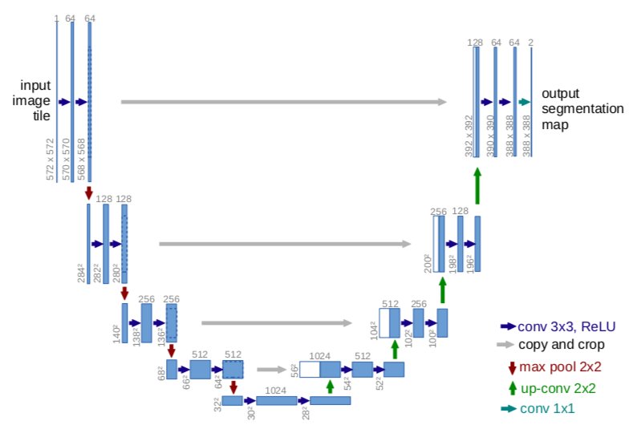
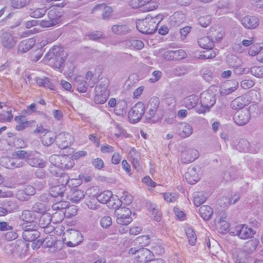
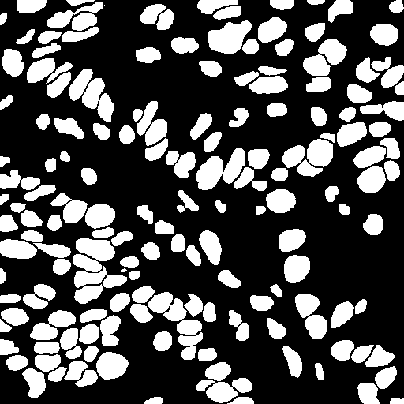
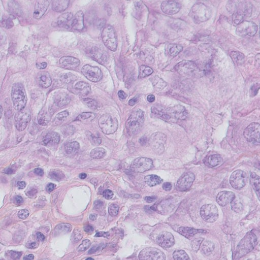
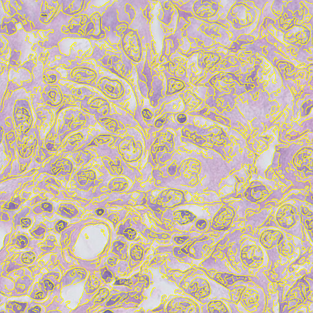
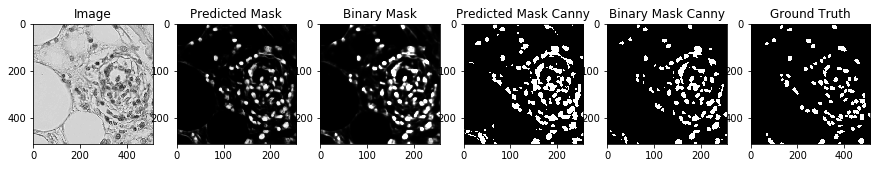

# Breast Cancer Image Segmentation
### Semantic Segmentation of Triple Negative Breast Cancer(TNBC) Dataset using U-Net CNN architecture

## Triple Negative Breast Cancer
*Triple-negative breast cancer (TNBC) accounts for about 10-15%  of all breast cancers. These cancers tend to be more common in women younger than age 40, who are African-American.*

*Triple-negative breast cancer differs from other types of invasive breast cancer in that they grow and spread faster, have limited treatment options, and a worse prognosis (outcome)*.  - **American Cancer Society**

Thus early stage cancer detection is required to provide proper treatment to the patient and reduce the risk of death due to cancer as detection of these cancer cells at later stages lead to more suffering and increases chances of death. **Semantic segmentation of cancer cell images can be used to improvise the analysis and diagonsis of Breast Cancer! This is such an attempt.**

## U-Net

U-Net is a State of the Art CNN architecture for Bio-medical image segmentation. *The architecture consists of a contracting path to capture context and a symmetric expanding path that enables precise localization.* It's a Fully Convolutional Network(FCN) therefore it can **work with arbitrary size images!** I've implemented an architecture similar to the original U-Net architecture, except I've used **"same"** padding instead **"valid"** which the authors have used. Using "same" padding throughout makes the output segmentation mask of same (height, width) as that of the input.

## Dataset Directory Structure

Below is the structure of the dataset. *train, images, label, img* are all directories and *img* has all the images/labels. The structure below is crucial for correct working of **ImageDataGenerator.flow_from_directory()** 
- train
   - images
      - img
   - label
      - img
        
## Sample image from the dataset

Original Image            |  Ground Truth Segmentation Label
:-------------------------:|:-------------------------:
  |  

## Sample image from the Canny edge "overlayed" dataset

Original Image            |  Canny Overlayed Image
:-------------------------:|:-------------------------:
  |  

## Comparision of model's prediction trained on Standard and Canny "overlayed" Dataset

**Note:** The text labels for 3rd and 4th(from the left) images above are swapped. Also Predicted Mask is for the model trained on the Original dataset, same for Binary mask.

***We can see that the prediction of model trained on the Canny dataset is better than the original dataset***

## References

1. [U-Net: Convolutional Networks for Biomedical Image Segmentation](https://arxiv.org/abs/1505.04597)
2. [Triple Negative Breast Cancer- American Cancer Society](https://www.cancer.org/cancer/breast-cancer/understanding-a-breast-cancer-diagnosis/types-of-breast-cancer/triple-negative.html)
3. [Deep Learning for Cancer Cell Detection and Segmentation: A Survey](https://www.researchgate.net/publication/334080872_Deep_Learning_for_Cancer_Cell_Detection_and_Segmentation_A_Survey)
4. [Transfusion: Understanding Transfer Learning for Medical Imaging](https://arxiv.org/abs/1902.07208)
5. [Dataset](https://zenodo.org/record/1175282#.Xl_4nZMzZQJ)

**Note:** Not an exhaustive list
